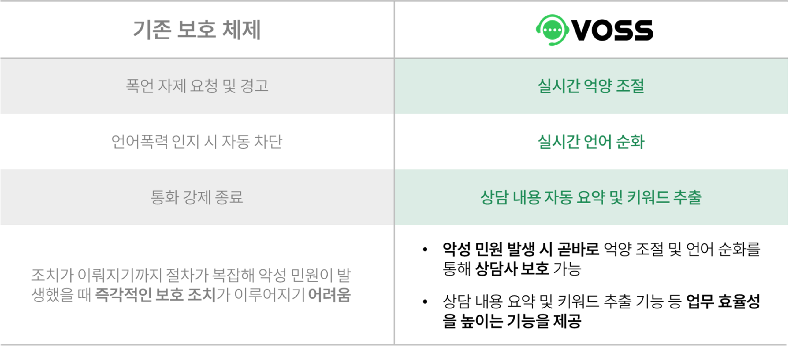
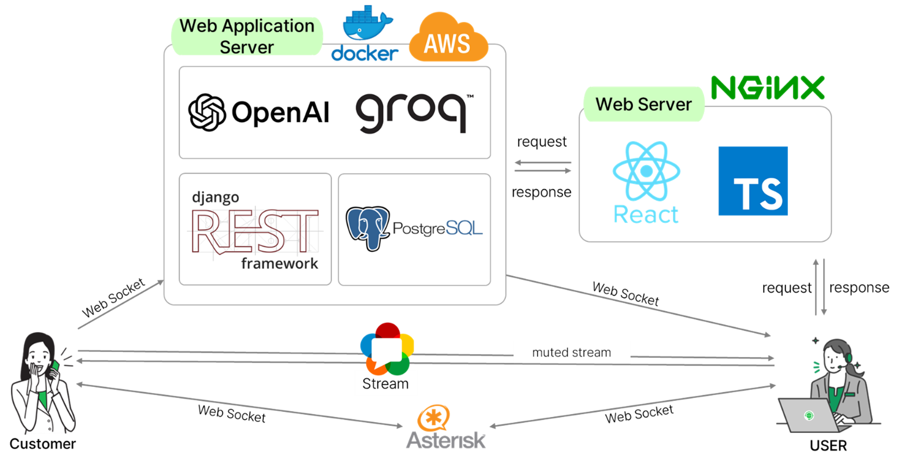

# VOSS
**Voice Of Smart System** : `AI`를 활용하여 `스마트`하게 `악성 민원에 대처`하는 `전화 민원 업무 관리 시스템`

## 프로젝트 개요

### 기간
- 2024.06.17 ~ 2024.07.30

### 프로젝트 주제
- 실시간 음성 감정 분류 모델을 활용한 악성 민원 탐지와 음성 변환을 활용한 억양 조절 시스템

### 주제 선정 배경
- 최근 악성 민원이 많이 발생하며 콜센터 직원들이 심리적 스트레스로 인해 극단적 선택을 하는 사건이 다수 발생하고 있음
- 기존의 상담사 보호 체제는 보호 조치가 시행되기까지 절차가 복잡하여 악성 민원이 발생했을 때 즉각적인 보호 조치가 이루어지기 어려움
- 악성 민원 발생 시 즉각적으로 조치를 취해 콜센터 직원들의 정신적 고통을 해소할 수 있도록 돕는 본 시스템을 제안

### 기존 보호 체제와의 차이점

## 프로젝트 내용

### 서비스 아키텍처

### 주요 서비스
1. 실시간 민원인 감정 분석
    - webRTC : SIP 서버로 민원인과 상담사 연결 후 webRTC로 통화
    - whisper-large-v3 : 민원인 음성 텍스트로 변환(STT)
    - gpt-4o : 텍스트 감정 분류 및 언어 순화
    - 민원인의 음성 데시벨과 감정으로 악성 민원 판단
2. 억양 조절
    - Google Cloud Text-to-Speech API : 악성 민원인의 음성 및 억양 변환(TTS)
3. 상담 내용 요약 및 키워드 추출
    - gpt-3.5-turbo : 전체 상담 내용 요약 및 키워드 추출
    - 이 내용을 기반으로 대시보드에 상담 현황 보여줌

## 기대 효과
1. 상담사 스트레스 감소 효과 : 언어적 악성 민원으로 인한 스트레스 감소
2. 민원 관리 업무 효율성 증대 : 대시보드로 키워드, 콜 건수 확인 가능
3. 고객 대응 최적화 : 이전 상담 기록 확인으로 고객 맞춤 상담 가능

## 팀원 및 역할

| 분야      | 구성원                |
|-----------|----------------------|
| Backend   | 곽정현, 장도진        |
| Frontend  | 장연지, 이솔          |
| AI        | 최영진, 신예빈, 박정재 |
